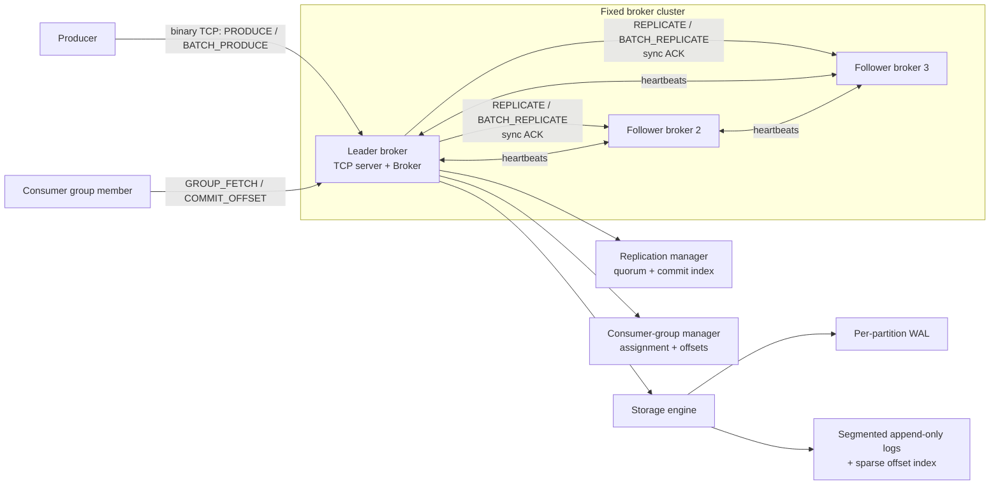

# Streaming Platform

A compact, replicated append-only log broker written in C++. It exposes a binary TCP protocol for producing and consuming partitioned messages, supports consumer groups with per-partition offsets, and elects a new leader when the active leader fails.

## What it provides

| Capability | Behavior |
|---|---|
| Partitioned logs | Append-only, segmented files with logical offsets |
| Replication | Leader replicates writes to followers and waits for a majority acknowledgement |
| Failover | Heartbeat-based election promotes the lowest-ID live broker in fixed membership |
| Consumer groups | One member owns a partition at a time; offsets are tracked per group/topic/partition |
| Delivery semantics | At-least-once: a group record remains eligible until its offset is committed |
| Producer batching | A batch appends ordered records to one partition and returns all offsets |
| Durability | WAL is synced before segment files every 64 records, plus flush/shutdown recovery |
| Transport | Versioned binary frames over TCP; client connections may carry multiple requests |

## Architecture



A producer receives success only after the leader and a majority of replicas acknowledge the write. If the leader fails, remaining brokers use heartbeat state to elect the lowest-ID live member.

## Project structure

```text
streaming-platform/
|- include/
|  |- config/          # Broker identity and cluster configuration
|  |- core/            # Broker and consumer-group coordination
|  |- network/         # TCP server
|  |- protocol/        # Binary request/response framing
|  |- replication/     # Quorum replication and leader election
|  `- storage/         # WAL, segments, and sparse offset index
|- src/
|  |- core/
|  |- network/
|  |- protocol/
|  |- replication/
|  `- storage/
|- tests/
|  |- protocol_test.cpp
|  |- integration_test.cpp
|  |- storage_test.cpp
|  `- performance_test.cpp
`- Makefile
```

## Prerequisites

- Linux or WSL2 with a C++17 compiler and GNU Make
- Standard POSIX networking support

On Ubuntu/WSL:

```bash
sudo apt update
sudo apt install build-essential
```

## Build and test

From the repository root:

```bash
make
make test
```

If the repository or binaries were moved into WSL and Linux reports `Permission denied`, restore the execute bit and rerun:

```bash
chmod +x broker tests/*
make test
```

### Test suite

| Command run by `make test` | What it validates |
|---|---|
| `tests/protocol_test` | Binary request/response encoding and batch codec round trips |
| `tests/integration_test` | Three-broker replication, forwarding, quorum commits, leader crash, election, and post-failover produce |
| `tests/storage_test` | Segmented-log persistence, offset-index rebuild, WAL recovery, and segment-write throughput |
| `tests/performance_test` | Localhost TCP throughput for a batch of 256 x 512-byte messages |

The integration test prints the observed loopback leader-failover time:

```text
localhost leader failover time: <milliseconds> ms
integration_test passed
```

The current test requires failover to complete within two seconds. In a recent local run, it completed in roughly 206 ms. Timing varies with host load.

Run an individual test:

```bash
./tests/integration_test
./tests/storage_test
./tests/performance_test
```

## Run a three-broker cluster

Use separate terminals. The first broker is initially the leader.

```bash
# Terminal 1
./broker --id 1 --port 9092 --host 127.0.0.1 --role leader \
  --peers 2:127.0.0.1:9093,3:127.0.0.1:9094

# Terminal 2
./broker --id 2 --port 9093 --host 127.0.0.1 --role follower --leader-id 1 \
  --peers 1:127.0.0.1:9092,3:127.0.0.1:9094

# Terminal 3
./broker --id 3 --port 9094 --host 127.0.0.1 --role follower --leader-id 1 \
  --peers 1:127.0.0.1:9092,2:127.0.0.1:9093
```

Pass `--data-dir <path>` to choose where a broker stores its per-partition WALs and segments.

## Protocol

Every TCP message is a 4-byte big-endian frame length followed by a versioned binary payload. Binary strings are length-prefixed, so messages can contain spaces, NUL bytes, and separator characters.

| Client command | Purpose |
|---|---|
| `METADATA` | Discover the active leader |
| `PRODUCE` | Append one message to a topic partition |
| `BATCH_PRODUCE` | Append ordered messages to one partition |
| `FETCH` | Read a committed record at a specific offset |
| `JOIN_GROUP` / `LEAVE_GROUP` | Join or leave a consumer group |
| `GROUP_ASSIGNMENT` | Retrieve the member's current partitions |
| `GROUP_FETCH` | Fetch the next uncommitted record for an assigned partition |
| `COMMIT_OFFSET` | Mark a processed group record complete |

Followers forward producer and consumer-group coordination requests to the leader.

### Batching and retries

`BATCH_PRODUCE` preserves record order within its target partition and returns every appended offset. A client that retries after a lost response can create duplicates; consumers should use application-level idempotency where duplicates matter.

## Consumer groups

Group assignment uses deterministic round-robin distribution across a topic's existing partitions. A partition has at most one assigned member at a time.

Each group tracks its own cursor per topic partition:

```text
(group, topic, partition) -> next committed offset
```

A `GROUP_FETCH` does not advance that cursor. Only `COMMIT_OFFSET` advances it, so an interrupted consumer may receive the same record again. This is at-least-once delivery with ordering preserved within each partition.

Group membership and offsets currently live in broker memory, so they are not retained across a broker restart.

## Replication, election, and durability

### Quorum replication

The leader writes locally, replicates to followers, and acknowledges the producer only after a majority has acknowledged. Batch replication uses one replication exchange per follower for the batch.

### Leader failover

Brokers exchange heartbeats every 100 ms. A missing leader is considered unavailable after 750 ms. Surviving members elect the lowest broker ID that they consider live.

This is a lightweight, fixed-membership election rule, not a full consensus protocol. It is designed for this project's local cluster model.

### Storage

Each topic partition has:

- an append-only sequence of size-bounded segment files;
- a sparse in-memory offset index rebuilt at startup;
- a write-ahead log for unflushed appends.

Every 64 appends, and on explicit flush or shutdown, the broker syncs the WAL, syncs the segment data, and clears the WAL. During recovery, unfinished WAL entries are replayed and incomplete segment tails are removed.
